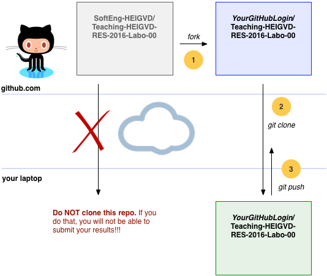
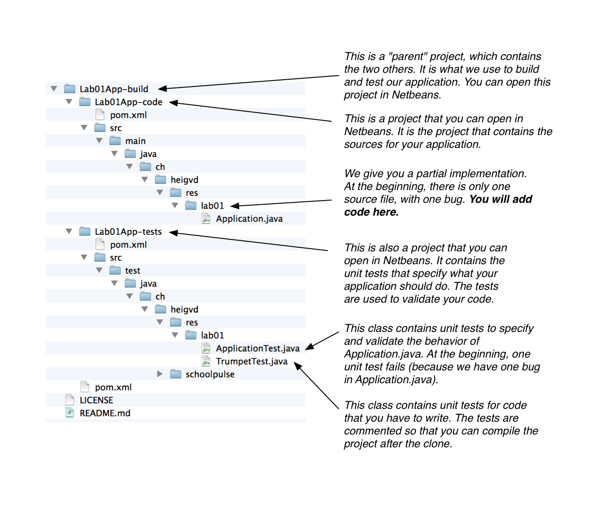
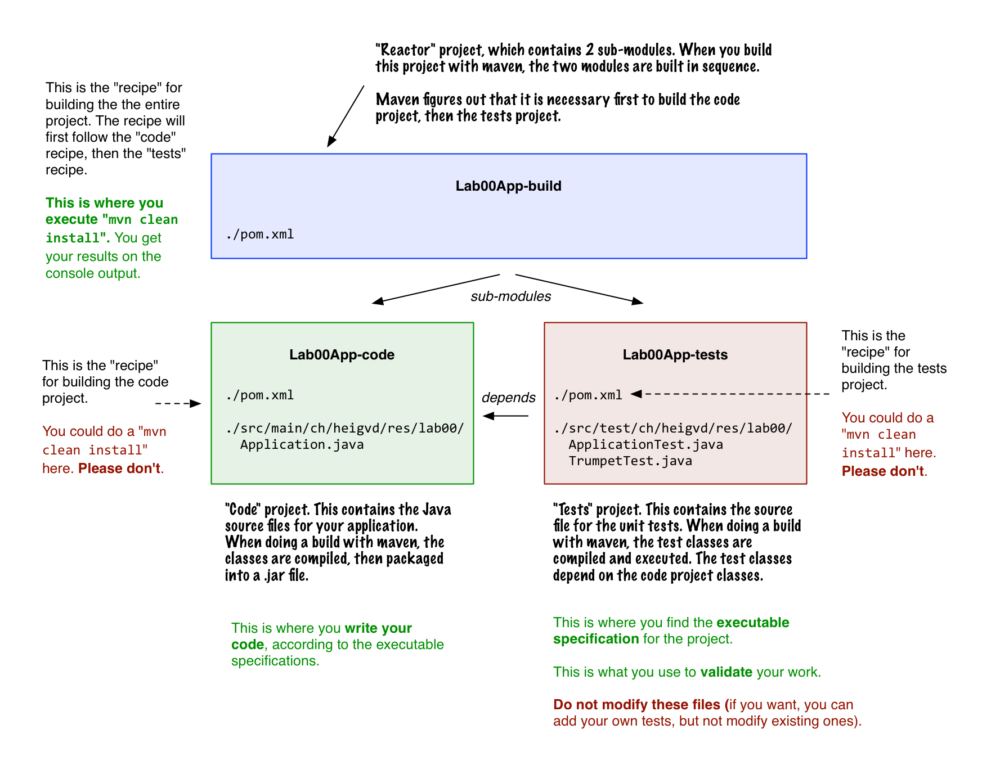
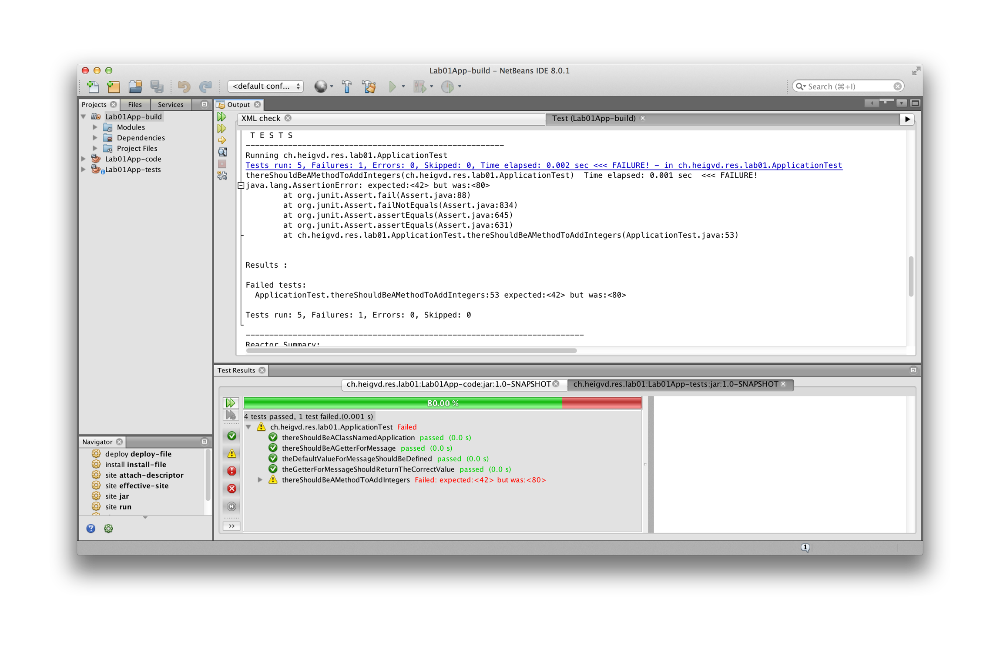
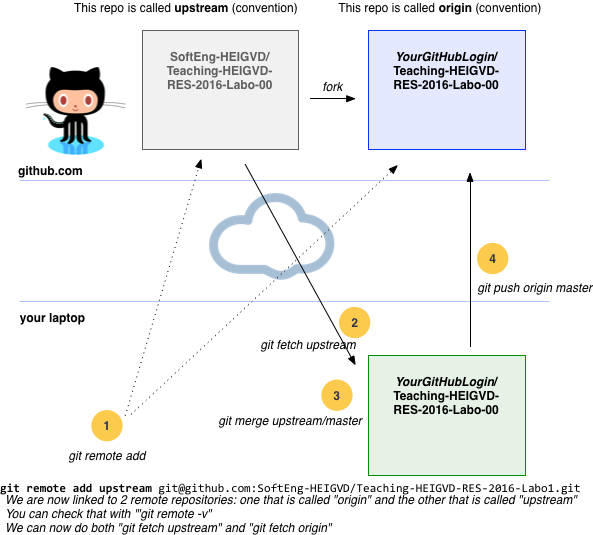

### Introduction

The first objective of this lab is to **get familiar with a couple of tools** that we will using during the semester. The second objective is to illustrate a number of **software engineering concepts and techniques**.

In the course, we have seen the notion of **continuous delivery pipeline**. We have seen that when we modify a piece of code and push it to our version management system, we want to automatically build it, validate it and deploy it so that new or improved functionality is available to our users. **A continuous delivery pipeline is made of several stages**. In every stage, different types of automated (and sometimes manual) tasks are executed.

In this lab, we are in first stage, often called the **commit stage**. Whenever a code change has been shared by a developer, we **immediately, automatically and quickly** check if something is wrong. If that is the case, we can give very rapid feedback to the developer, who will still have the context and should be able to fix the issue quite easily. There are different of checks that we can make at this stage:

* does my code compile?
* do my unit tests pass?
* is the quality of my code acceptable (are there violations of coding conventions or other issues?)

This week, we will look at the first two checks. Later in the semester, we will see that we can easily add code quality controls and will do it.


Some of you may already be familiar with the tools (in particular with the **apache maven** build tool) and should be able to do the lab very quickly. For the others, we hope that this will provide a gentle introduction to something that you will encounter in most enterprise and open source Java projects (gradle is an alternative).

### Webcasts

You can find 3 webcasts on Youtube that describe this lab and illustrate it with a live demo. That is something that will be helpful if you have never used maven or if you are not too familiar with git and GitHub.

Here is the URL of the [playlist](https://www.youtube.com/playlist?list=PLfKkysTy70QY_hFBnm6zPcau64iAIkkhr). Look for the videos entitled **RES 2015 - Lab 00 - 01, 02 and 03**.

Be aware that the webcasts have been recorded for another course, so the name and URLs of the repositories will be a bit different. You should not have any issue with the rest though.

### Tasks

To complete the lab, after reading these instructions, you will have to do the following tasks:

* **Task 1** : Setup the environment
* **Task 2** : Fork this GitHub repo
* **Task 3** : Understand the project structure
* **Task 4** : Develop the Java code according to the executable specification
* **Task 5** : Submit your results


-----

### Task 1 : Setup the environment

First of all, you need to understand that you have different ways to do the labs and to setup your work environment:

* One possibility would be to install all tools directly on top of your operating system. You would use your IDE, build the software, run the tests in your usual environment. That would work, but there are always some issues with differences between operating systems. That can be a real PITA.

* An alternative is to use the "lab box" that we have prepared for you (see [this repo](https://github.com/SoftEng-HEIGVD/Teaching-HEIGVD-RES-2016-LabBox)). You will have all the tools pre-installed in a linux VM, controlled by Vagrant.

* Last but not least, you can mix the two solutions (that's our favorite setup). When you use Vagrant, you can mount folders from your host file system into the VM. This means that you can use your IDE (e.g. Netbeans) on your host system and at the same time build/execute the project in the VM, in command line.

Because of this, **the steps 1.1, 1.2 are optional**. Since it is a bit time consuming to install Java and maven, I recommend that you first do the lab. You can always to the additional setup after the course.


#### 1.1. Make sure that you have a JDK 1.8 installed (optional)

You should use Java 8. Depending on the platform, it can be a bit tricky to figure out which JDK is actually used when you run a Java application. When you build the same project in Netbeans or on the command line, it is possible that a different version of the JDK is actually used. Keep this in mind if you encounter issues (maven might complain).

For Mac OS users, [here](http://stackoverflow.com/questions/6588390/where-is-java-home-on-osx-yosemite-10-10-mavericks-10-9-mountain-lion-10) and [there](http://stackoverflow.com/questions/17824889/how-to-force-maven-3-1-to-use-right-version-of-java-on-mac-os-8-10), you will find useful information.

To **validate** your installation, you can do a `java -version` from the command line.


#### 1.2. Install apache maven (optional)


**Note**:* you might skip this step if you don't want to build your projects on the command line in your host operating system (i.e. if you want to build it with Netbeans on your host and with maven in the Vagrant lab box). However, installing maven is quick and easy, so we recommend that you do it.*

Apache maven is a software development tool that is extremely popular in the Java community. As a matter of fact, if you work in a professional environment or contribute to an open source project, there is *no way* that you will escape it.

While our goal is not to make you a maven expert in this course, we want you to get familiar with it. You will use maven to build, test and run your projects, so it is important that you have a high-level understanding of what it does.

If you have used Makefiles, ant scripts or Grunt.js, you are already familiar with the notion of **software build automation**. Simply stated, maven is used to write recipes for transforming source code into running software. It manages the entire build cycle, which includes tasks such as compilation, unit testing, integration testing, code quality checks, packaging and deployment.

We will not get into further details right now. Installing maven on your machine is easy. Just go [here](http://maven.apache.org/download.cgi#Installation) and follow the instructions. When you are done, make sure to update your system path so that you can invoke maven with the `mvn` command from a terminal, wherever your are. If you are using Windows, [this](http://crunchify.com/how-to-setupinstall-maven-classpath-variable-on-windows-7/) page might be helpful.

When you have installed maven, you should be able to type `mvn -v` on the command line and see the following output:

```
$ mvn -v
Apache Maven 3.1.0 (893ca28a1da9d5f51ac03827af98bb730128f9f2; 2013-06-28 04:15:32+0200)
Maven home: /Users/admin/tools/maven/apache-maven-3.1.0
Java version: 1.8.0_11, vendor: Oracle Corporation
Java home: /Library/Java/JavaVirtualMachines/jdk1.8.0_11.jdk/Contents/Home/jre
Default locale: en_US, platform encoding: UTF-8
OS name: "mac os x", version: "10.9.5", arch: "x86_64", family: "mac"
```


In your home directory, there is a hidden directory named `.m2`. It contains a file named `settings.xml`, which is used to configure various aspects of your maven installation. On both Unix and Windows systems, the path to the file should be as follows:

```
~/.m2/settings.xml
```

If you are unsure of the exact path to this file, type `mvn -X` on the command line to run maven in debug mode.
The command will produce an error because no goal was specified, but it will also output the path to the `settings.xml` file you are looking for.
Note the second `[DEBUG]` line which tells you where to find your user's `settings.xml` file:

```
$ mvn -X
Apache Maven 3.2.3 (33f8c3e1027c3ddde99d3cdebad2656a31e8fdf4; 2014-08-11T22:58:10+02:00)
Maven home: /opt/local/share/java/maven3
Java version: 1.8.0_25, vendor: Oracle Corporation
Java home: /Library/Java/JavaVirtualMachines/jdk1.8.0_25.jdk/Contents/Home/jre
Default locale: en_US, platform encoding: utf-8
OS name: "mac os x", version: "10.10.2", arch: "x86_64", family: "mac"
[INFO] Error stacktraces are turned on.
[DEBUG] Reading global settings from /opt/local/share/java/maven3/conf/settings.xml
[DEBUG] Reading user settings from /Users/your-user/.m2/settings.xml
[DEBUG] Using local repository at /Users/your-user/.m2/repository
[DEBUG] Using manager EnhancedLocalRepositoryManager with priority 10.0 for /Users/your-user/.m2/repository
[INFO] Scanning for projects...
[DEBUG] Extension realms for project org.apache.maven:standalone-pom:pom:1: (none)
[DEBUG] Looking up lifecyle mappings for packaging pom from ClassRealm[plexus.core, parent: null]
[INFO] ------------------------------------------------------------------------
[INFO] BUILD FAILURE
[INFO] ------------------------------------------------------------------------
[INFO] Total time: 0.097 s
[INFO] Finished at: 2015-02-20T10:33:16+01:00
[INFO] Final Memory: 5M/245M
[INFO] ------------------------------------------------------------------------
[ERROR] No goals have been specified for this build.
...
```

You have to edit this file and **add your GitHub login name** in a new `<profile></profile>` section.
If this is your first time installing or configuring maven, the file may not exist so you may have to create it yourself.
Have a look at the example below. Grab the text, replace `wasadigi` with **your GitHub login** and save the file.

```
<settings>
...
  <profiles>
    <profile>
      <id>schoolPulse</id>
      <activation>
        <activeByDefault>true</activeByDefault>
      </activation>
      <properties>
        <ch.heigvd.schoolpulse.userid>wasadigi</ch.heigvd.schoolpulse.userid>
      </properties>
    </profile>
...
  </profiles>
...
</settings>
```

#### 1.3. Install NetBeans


In this course, we will be writing a lot of code, mostly in Java. We use Netbeans to prepare the labs and samples. So, if you use Netbeans, your life will be easier. If you prefer to use another IDE, that should be fine for most of the labs (we will let you know otherwise). But we will not be able to provide individual support for all IDEs, so you have to be ready to investigate issues on your own.

#### 1.4. Install and get familiar with a *real* command line tool


From what we have seen over the last few years, many students are not familiar or **comfortable with a terminal and command line tools**. This is particularly true for students using Windows as their main operating system. Launching `cmd.exe` is not something very common, and once in the terminal, it is not very easy nor practical to get work done.

**If you are in this situation, then it is now time to get familiar with proper tools**. This will make you a lot more productive. It will save you time during labs (not only in this course). It will allow you to do things in a cleaner and more efficient way.

**You do not have to be a shell guru**. Even with a couple of commands, you will quickly see the benefits. **Please, please** take the time to learn how to use this crucial tool.

If you are on **Windows**, then you have several options, including PowerShell, Gygwin, Git Bash or Babun, which seems to be gaining traction. Some of the options are described [here](https://macyves.wordpress.com/2014/09/18/hipsterising-windows-cygwin-vs-babun-vs-git-bash-vs-powershell-the-onion-scale/). To be honest, I am *not* a Windows user, so it is difficult for me to make a recommendation and you will have to make your own experiments. But if you have not used any of these tools, take the time to pick one and learn how to use it. Otherwise, you will loose an awful lot of time and will not be able to do some of the labs (this year and next year). 

#### Check that you can do a tail

[Unix tail](http://en.wikipedia.org/wiki/Tail_%28Unix%29)

[PowerShell](https://technet.microsoft.com/en-us/library/hh849787.aspx)

[PowerShell -Tail](http://www.howtogeek.com/tips/how-to-get-tail-like-functionality-on-windows-with-powershell/)

#### Check that you can do a grep

[Unix grep](http://en.wikipedia.org/wiki/Grep)

[PowerShell](https://communary.wordpress.com/2014/11/10/grep-the-powershell-way/)

-----

### Step 2 : Fork the GitHub repo

Ok, now that your environment is setup, **time to get to the real work**. For the labs, we will be using a **collaborative development workflow**. You have to be familiar with git and the GitHub service. Here is a high-level description of the workflow:



1. We will create **one GitHub repo for every lab**. This repo will contain the instructions and a code skeleton. Often, we will provide a collection of JUnit tests that will allow us to **specify**, **validate** and **grade** your projects. If you try to run the JUnit tests at the beginning of the project, most of them should fail (they might not even compile). Reading the code of the tests will let you know what we expect from you (the tests are an **executable specification**).

2. You will **fork** the lab repo. Read this sentence again very carefully: we said **fork** and **not clone**. Forking the lab repo means that you will have your own copy of the lab repo hosted on GitHub, so that you can work independently. You will then **clone your fork** on your machine. Once again, what you are cloning is your fork, not the original repo. Got it?

3. You will then work on the assignment, write code do you tests. You should get used to commit your work on a regular basis (which means that you will have a local history). Before the submission date, you will then **push** your commits to your fork. You should also create a **pull request**, so that we know that you are done (and it's a way for us to provide feedback on the code).

4. *We know where you live*. After submission, we will check your forks. We have our own suite of automated tests, which we will use to evaluate your work.

#### How and where should I clone my fork?

The recommended setup is described in the [lab box repo](https://github.com/SoftEng-HEIGVD/Teaching-HEIGVD-RES-2016-LabBox). If you read carefully, you will see that we recommend to clone your fork within the directory containing the `Vagrantfile`. This is how you make it possible to access the project files both from your host and from the VM.

If you don't know how to create a fork on GitHub, or how to clone your fork, take 5 minutes to watch [this webcast](https://www.youtube.com/watch?v=uqIva5-mKMs&list=PLfKkysTy70Qb_mfkkqa5OUMqsOPNEYZIa&index=1).

-----

### Task 3 : Understand the project structure

If you have followed the previous instructions, then you should now have a clone of your fork on your machine, in a directory named `Teaching-HEIGVD-RES-2015-Labo1`. Let's check what is inside:



If you look carefully, you will see that there are 3 files named `pom.xml` in the directory structure. These files are used by **maven** and you can think of them as 3 recipes for building our application. As indicated in the diagram, we actually have 3 projects. One with the application code, one with the automated tests and one on top of them. What we are going to do is build the top-level project. Maven will automatically compile the application code, compile the test code, run the tests and give us results. If all tests pass, then Maven will also produce a .jar file.



-----


### Task 4 : Develop the Java code according to the executable specification

**Note**: if you want to have a preview of what you will do, have a look at this [webcast](https://www.youtube.com/watch?v=8LFbasLgM-M&list=PLfKkysTy70Qb_mfkkqa5OUMqsOPNEYZIa&index=2) and at [this one](https://www.youtube.com/watch?v=P3aMCCuAFv0&list=PLfKkysTy70Qb_mfkkqa5OUMqsOPNEYZIa&index=3).

Before opening Netbeans, let's build our software from the command line. To do that, we have to move into the top-level project, where the first `pom.xml` file is located and type the following command: `mvn clean install`. By doing that, we are asking maven to clean the workspace and to start the build process. You will see a long output on the console, starting with this:

```
$ cd Teaching-HEIGVD-RES-2015-Labo1/
$ ls
LICENSE		Lab00App-build	README.md
$ cd Lab00App-build/
$ ls
Lab00App-code	Lab00App-tests	pom.xml
$ mvn clean install
[INFO] Scanning for projects...
[INFO] ------------------------------------------------------------------------
[INFO] Reactor Build Order:
[INFO] 
[INFO] Lab00App-code
[INFO] Lab00App-tests
[INFO] Lab00App-build
[INFO]                                                                         
[INFO] ------------------------------------------------------------------------
[INFO] Building Lab00App-code 1.0-SNAPSHOT
[INFO] ------------------------------------------------------------------------
[INFO] 
...
```

If you go back in the terminal (and that is one first example that shows how important it is to have a proper command line tool!), you will notice the following section:

```
-------------------------------------------------------
 T E S T S
-------------------------------------------------------
Running ch.heigvd.res.lab00.ApplicationTest
Tests run: 5, Failures: 1, Errors: 0, Skipped: 0, Time elapsed: 0.002 sec <<< FAILURE! - in ch.heigvd.res.lab00.ApplicationTest
thereShouldBeAMethodToAddIntegers(ch.heigvd.res.lab00.ApplicationTest)  Time elapsed: 0 sec  <<< FAILURE!
java.lang.AssertionError: expected:<42> but was:<80>
	at org.junit.Assert.fail(Assert.java:88)
	at org.junit.Assert.failNotEquals(Assert.java:834)
	at org.junit.Assert.assertEquals(Assert.java:645)
	at org.junit.Assert.assertEquals(Assert.java:631)
	at ch.heigvd.res.lab00.ApplicationTest.thereShouldBeAMethodToAddIntegers(ApplicationTest.java:53)


Results :

Failed tests: 
  ApplicationTest.thereShouldBeAMethodToAddIntegers:53 expected:<42> but was:<80>

Tests run: 5, Failures: 1, Errors: 0, Skipped: 0
```

Very interesting: we see that 5 tests have been successfully run and that one has failed. We see that there seems to be a bug in the method that computes the sum between two integers... Indeed, if we look at the code, we see that the code of the `add(int a, int b)` method is wrong:

```
$ cat Lab00App-code/src/main/java/ch/heigvd/res/lab00/Application.java 
package ch.heigvd.res.lab00;

/**
 * This is a very simple class used to demonstrate the specify-implement-validate
 * cycle. All methods used in the JUnit test are defined, so the test class will
 * compile. There is a bug in the add method, so one of the tests is expected
 * to fail.
 * 
 * If you look at the class named ch.heigvd.res.lab00.ApplicationTest, you will
 * find an executable specification for this class. The test methods specify
 * the expected behavior for this class.
 * 
 * @author Olivier Liechti
 */
public class Application {

  private String message;

  public Application() {
    this("HEIG-VD rocks!");
  }

  public Application(String message) {
    this.message = message;
  }

  public String getMessage() {
    return message;
  }

  public int add(int a, int b) {
    return a * b;
  }

}
```

After fixing the bug, we do another `mvn clean install` and this time, we see the following output:

```
-------------------------------------------------------
 T E S T S
-------------------------------------------------------
Running ch.heigvd.res.lab00.ApplicationTest
Tests run: 5, Failures: 0, Errors: 0, Skipped: 0, Time elapsed: 0.002 sec - in ch.heigvd.res.lab00.ApplicationTest

Results :

Tests run: 5, Failures: 0, Errors: 0, Skipped: 0
```

Sweet. Our implementation now is compliant with the executable specification. Well, that's because some unit tests have been commented out. Open the `TrumpetTest.java` file and uncomment the unit tests. Note that if you try to build the project now, it will fail. The reason is that the tests specify that you should have created interfaces and classes. You have not done that yet, and it is your assignment in this lab. 

If you read the name of the test methods, you will see that they are a way to specify the expected behavior of your application (that is why we speak of executable specification):

```
thereShouldBeAnIInstrumentInterfaceAndATrumpetClass
itShouldBePossibleToPlayAnInstrument
aTrumpetShouldMakePouet
aTrumpetShouldBeLouderThanAFlute
aTrumpetShouldBeGolden
```
To get all the details of the specification, you will have to take a close look at the body of the methods, such as this one. It should be pretty straightforward to determine what you have to implement in the `Lab00App-code` project (do **not** add the application classes in the `Lab00-App-tests` project!).

```
  @Test
  public void aTrumpetShouldMakePouet() {
    IInstrument trumpet = new Trumpet();
    String sound = trumpet.play();
    Assert.assertEquals("pouet", sound);
  }
```

What we have done in the terminal can also be done directly in Netbeans:

- open the Lab00App-build project

- right-click on the Lab00App-build node in the Project tab and select *Open Required Project > Open All Projects*

- righ-click on the Lab00App-build node and select *Test*

You will see the following output in the IDE tabs. In the *Output* tab, you will see the same output that was generated when invoking maven on the command line. In the *Test Results* tab, you will see a user friendly visual representation of the test results. 

**After cloning the repo, you see 4 green tests and 1 red test. When you have finished the lab, you should see 10 green tests.**




### Task 5 : Submit your results

When you are done, you have to make sure that you push your changes to your fork hosted on GitHub. Indeed, to check your work, we will get the last version of your fork and run our test suite on your code.

Typically, what you will do is the following:

```
# We have modified several local files. We want to take a snapshot
# of files xxx.java and xx2.java and add it to the project history

git add xxx.java
git add xx2.java


# The staging area contains the 2 files. We can now create a local
# commit and provide a message

git commit -m "Implementation of xxx according to specification"


# Finally, we want to send the commit to the fork, so that it is visible
# for other users

git push origin master
```

Last but not least, we ask you to make a **pull request**. In a typical open source project, the following workflow is used by contributors:

1. The contributor wants to **make a contribution** (create a new feature, fix a bug, contribute to the documentation), so he **creates a fork**.
2. (*optional*) The contributor creates a **feature branch**.
3. The contributor **implements** a new feature or fixes a bug in his fork.
4. The contributor **does not have write access on the upstream server** (the original repo for the open source project)
5. For this reason, he **asks** the people who have the right to commit code on the upstream server to **pull** changes from the fork
6. On GitHub, this is not done by phone or email, but via the Web UI. On the fork home page, there is a "Pull Requests" menu. Clicking on the green button labeled *New pull request* initiates the process.
7. The committers review the submitted commits. They can add line-by-line comments, discuss with the contributor, etc. In the end, **they may accept or reject the pull request**.

In our workflow, we will most likely **not** accept your pull requests. However, having a pull request is a nice way to **notify us** that you are done with the implementation. It also give us a mechanism to give you **line-by-line feedback**.

----

### FAQ

#### If the authors of the original repository make updates, how do I get them?

Let us imagine that we find a bug somewhere in the **https://github.com/wasadigi/Teaching-MSE-SEA-2016-Instruments** repo. We want to fix it and make sure that all students can get the fix in their own fork. How do we do that? 

This operation cannot be done via the Web UI, but it is fairly easy and well documented. First, you have to [configure an upstream server](https://help.github.com/articles/configuring-a-remote-for-a-fork/). Then, you can [sync](https://help.github.com/articles/syncing-a-fork/) your local clone with the upstream server. Finally, you can [push](https://help.github.com/articles/pushing-to-a-remote/) the update to your fork. 



#### I am lost with these git commands, where I can find help?

There are many resources available, here are a few suggestions:

* There is a great documentation provided by Atlassian [here](https://www.atlassian.com/git/tutorials/setting-up-a-repository). It starts with simple concepts and commands, but goes to fairly advanced topics.

* GitHub also provides really useful information, [here](https://help.github.com/categories/bootcamp/), [here](https://help.github.com/articles/good-resources-for-learning-git-and-github/) and [here](https://training.github.com/kit/).


